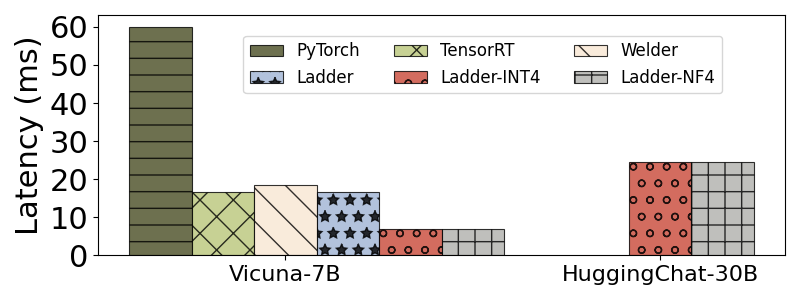

# Ladder LLM

The Ladder LLM repo is the artifact for the poster **Ladder: Efficent Tensor Compilation on Cunstomized Data Fromat** presented at OSDI '23. ladder llm aims to optimize large language models by leveraging quantization and memory fusion techniques. By efficiently compiling tensor computations on customized data formats, Ladder LLM addresses the challenges posed by various hardware platforms and data formats in the deep learning community.

## Features

- Fast and Efficient Kernel Support for diverse data formats and bitwidths： e.g. 4-bit inference，support INT4, FP4, NF4, W4A16 can be 4x faster in general.
- Efficient Model Compilation supported by nnfusion.
- Efficient Memory Fusion supported by welder.
- archieve 80% theory performance of HuggingChat30B-4bit on NVIDIA RTX 3090.


## Quick Start

### Python Environment

- torch == 2.0.1
- transformers == 4.28.1
- onnx == 1.10.1
- onnxruntime-gpu == .15.0
- onnxsim == 0.4.24

### Install nnfusion

nnfusion is a powerful codegen framework that is designed to convert deep learning models into CUDA code, enabling the models to run efficiently on NVIDIA GPUs. By compiling models into CUDA code, nnfusion allows users to take advantage of advanced optimization techniques such as rammer, roller, and welder to enhance the model's performance and reduce memory usage.

```bash
# mv into nnfusion folder
cd nnfusion
# install dependencies
./maint/script/install_dependency.sh 
# build nnfusion
mkdir build; cd build; cmake ..; make -j
# mv out of nnfusion folder
cd ..
```

the nnfusion command line tool is located in the `nnfusion/build/src/tools/nnfusion/nnfusion`` directory within the nnfusion directory.

### Install tvm

tvm is a powerful deep learning compiler that is designed to optimize deep learning models for various hardware platforms. the version of tvm we use is based on [welder_tvm](https://github.com/nox-410/tvm/tree/welder), which is a customized version of tvm that incorporates welder memory fusion support. 

```bash
# mv into tvm folder
cd tvm
# build tvm
mkdir build; cd build; cp ../cmake/config.cmake .; 
echo set\(USE_LLVM ON\) >> config.cmake;
echo set\(USE_CUDA ON\) >> config.cmake; 
cmake ..; make -j
# mv out of tvm folder
cd ..
```

### Prepare Quantized onnx checkpoint

To provide an example, we use auto gptq to quantize vicuna and huggingchat, we made some changes to the original code to make it compatible with nnfusion and ladder codegen, we assume the quantized onnx checkpoint is in `quantization/models`.

```bash
# mv into quantization folder
cd quantization 
# quantize vicuna
python3 quantize.py --pretrained_model_dir vicuna-7b-v1.1 --quantized_model_dir /models/vicuna-7b-v1.1-4bit
# quantize huggingchat 
python3 quantize.py --pretrained_model_dir oasst-rlhf-2-llama-30b-7k-steps-xor --quantized_model_dir /models/huggingchat-30b-rlhf-2-4bit
# mv out of quantization folder
cd ..
```

### model compile

use nnfusion to get the model desc json file

```bash
PYTHONPATH=$(pwd)/welder/python:$(pwd)/tvm/python nnfusion/build/src/tools/nnfusion/nnfusion quantization/models/huggingchat-30b-rlhf-2-4bit/qmodel_b1s1.onnx -f onnx -ftune_output_file=model.json -ffusion_skiplist="Dot,BatchMatMul,QuantLinear" -fdot_permutation=0 -fort_folding=0 | tee get_model_block.log
```

use welder to do memory fusion, it is important to note that the Ladder compiler is not currently open-sourced. As an alternative, we provide a pre-compiled CUDA source code that can be used for model compilation, ensuring users can still leverage the benefits of memory fusion without directly accessing the Ladder compiler.

```bash
PYTHONPATH=$(pwd)/welder/python:$(pwd)/tvm/python CPLUS_INCLUDE_PATH=$(pwd)/cutlass/include python3 -m run_compiler model.json tuned.json --device 0 --topk 20 --arch g3090 | tee run_compiler.log  
python3 qlinear_kernel_replace.py
```

cuda code generation.

```bash
PYTHONPATH=$(pwd)/welder/python:$(pwd)/tvm/python nnfusion/build/src/tools/nnfusion/nnfusion quantization/models/huggingchat-30b-rlhf-2-4bit/qmodel_b1s1.onnx  -ftune_output_file=/dev/null -ftune_input_file=tuned_new.json -ffusion_skiplist="Dot,BatchMatMul,QuantLinear" -fwarmup_step=5 -frun_step=10 -fdot_permutation=0 | tee get_model_block.log
```

model benchmarking

```bash
cd nnufion_rt/cuda_codegen
cmake .; make -j
./main_test
```


